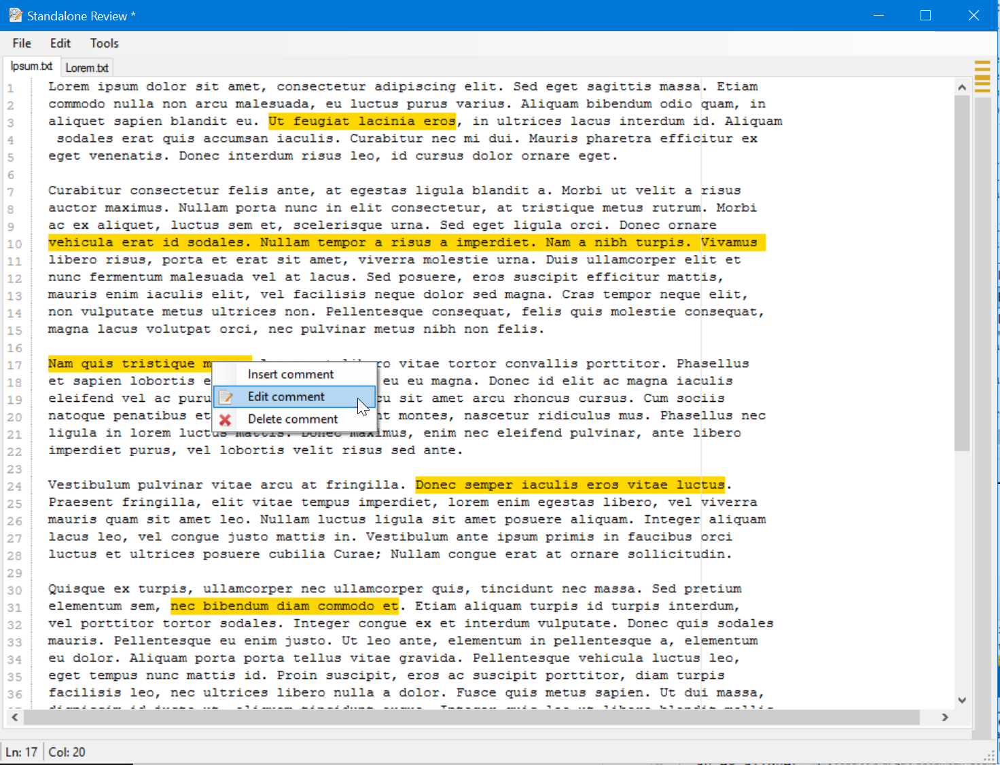

 Standalone Review
====================

This is an application that helps you to make code reviews. There are alot of applications that can do this for you, but almost all of them are build to be collaborative and connected to a server or installed on a server and accessed through a webclient. 
So in order to use them you have to be connected to the internet, and you have to have a server where you can install the server part of the tool, and if you want to use those tools in work related projects, you have to have permission from the IT-department to install the tool on the server.

**Stanalone Review** is build to be entirely standalone and disconnected. If you have the file you want to review locally and you have **Standalone Review** installed, you can make comments to the file, thats it.

Task Lists
----
- [ ] Open multiple files in a Review
- [ ] Manually choose the locale used for the application
- [ ] Show mini-markers for where the comments are in the file
- [ ] Open Review 
- [ ] Use richtext to format the review
- [ ] Save the review as HTML

Icons
----
Icons for the application is from: [https://github.com/ioBroker/ioBroker.icons-open-icon-library-png]([https://github.com/ioBroker/ioBroker.icons-open-icon-library-png])

Screenshots
----
The main form:

The insert comment dialog:

The preview review dialog

